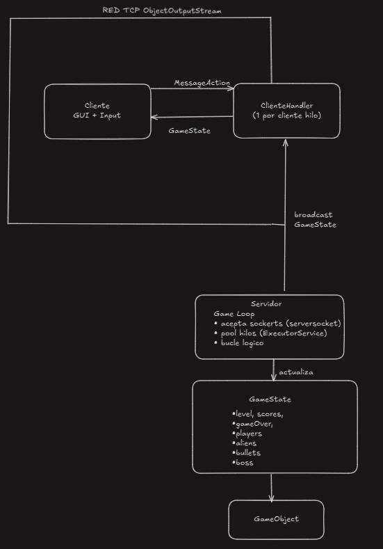

# SpaceInvaders
**Explicando el proyecto y las interacciones de clases**

## Visión general del proyecto

El juego **Space Invaders Multijugador en Red** sigue un modelo **cliente-servidor** con autoridad total del servidor sobre la lógica del juego.

1. **Servidor (`Servidor.java`)**

    * Escucha sockets (`ServerSocket`) y acepta hasta *N* jugadores.
    * Crea un `ClientHandler` por cliente y lo ejecuta en un `ExecutorService`.
    * Mantiene un único `GameState` con **jugadores**, **aliens**, **balas** y (a partir del nivel 6) un **boss**.
    * Corre un bucle de juego cada 50 ms: actualiza la física, resuelve colisiones, avanza niveles y envía un *snapshot* del `GameState` a todos los clientes.

2. **Cliente (`Cliente.java`)**

    * Muestra la GUI con Swing (`JFrame` + `GamePanel`).
    * Captura teclado y, en un *timer* de 50 ms, envía al servidor acciones (`MessageAction`) ―mover, disparar, etc.
    * Escucha en un hilo aparte los objetos `GameState` que manda el servidor y los dibuja en su `GamePanel`.

3. **Comunicación**

    * **Formato**: objetos Java serializables intercambiados por `ObjectOutputStream` / `ObjectInputStream`.
    * **Direcciones**:

        * Cliente → Servidor : `MessageAction` (input del jugador).
        * Servidor → Cliente : `GameState` (estado completo).

4. **Modelo del juego**

    * `GameObject` (abstracto) → `Player`, `Alien`, `Bullet`, `Boss`.
    * `GameState` agrega listas de estas entidades + nivel, puntuaciones y flags de juego.
    * La representación visual la hace cada clase en su método `draw(Graphics)`; el servidor nunca dibuja, sólo actualiza.

5. **Flujo típico**

    1. El servidor se inicia, selecciona puerto y nivel inicial.
    2. Un cliente se conecta, recibe su **ID** y se añade un nuevo `Player` al `GameState`.
    3. Cada fotograma:

        * Cliente envía `MOVE_LEFT`, `SHOOT`, etc.
        * Servidor procesa la acción ⇒ actualiza posiciones o crea balas.
    4. Servidor transmite el `GameState`; el cliente lo pinta.
    5. Cuando no quedan aliens (o el boss muere) se pasa de nivel. Si un alien toca la línea inferior, o mueren todos los jugadores, se marca *Game Over*.

---

## Diagrama ASCII de comunicación y dependencias

### Leyenda 

* **Cliente** usa `GamePanel` para **renderizar** y envía **inputs** (`MessageAction`).
* **ClientHandler** es el puente 1-a-1 entre cada cliente y el **Servidor**.
* **Servidor** mantiene el estado, ejecuta la lógica y hace *broadcast* del `GameState`.
* Dentro de `GameState` viven todas las entidades (`Alien`, `Player`, etc.), herederas de `GameObject`.

